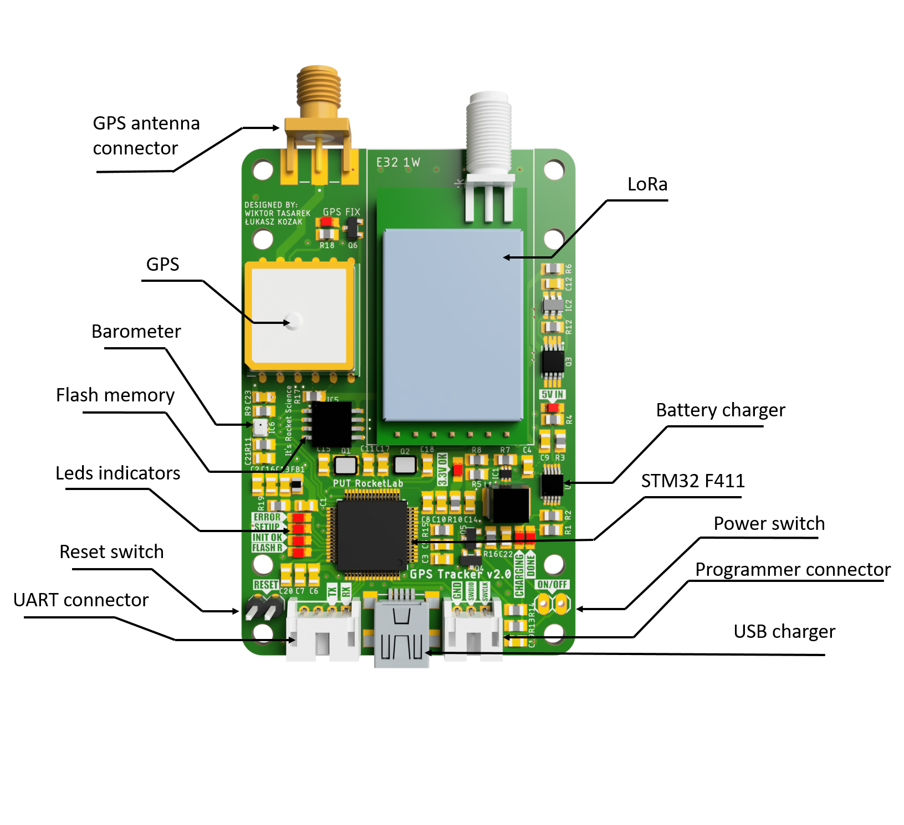
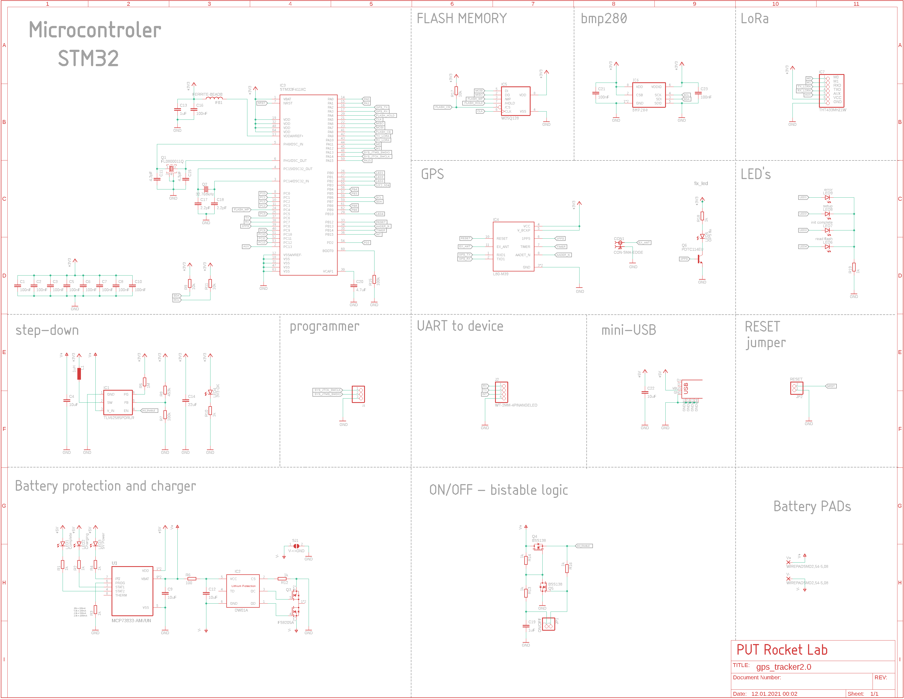
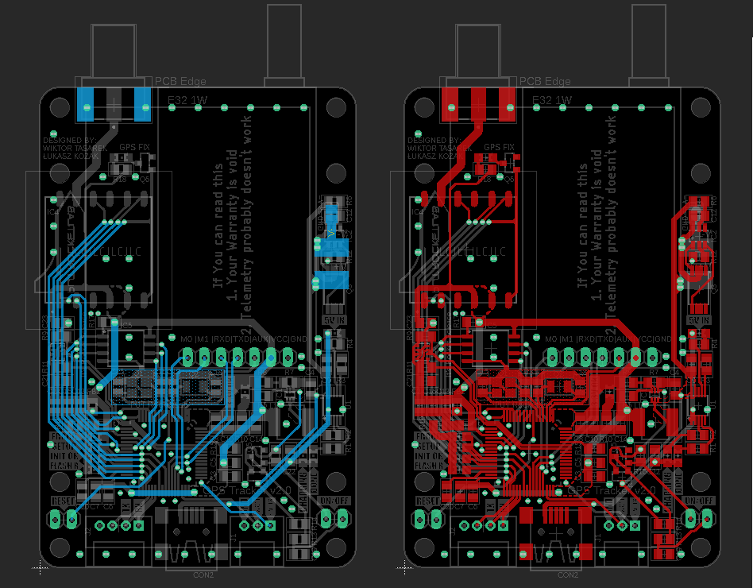
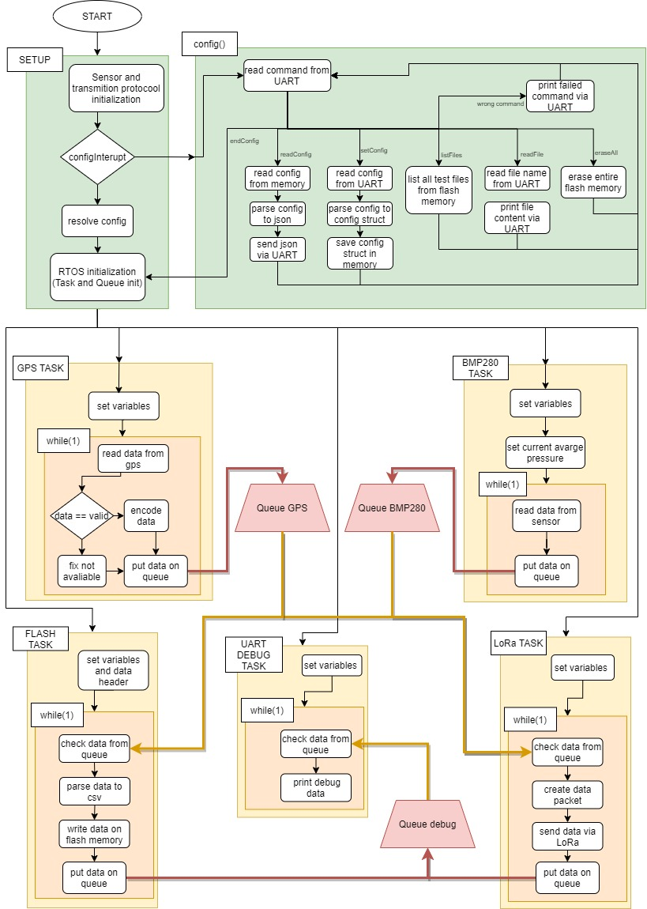
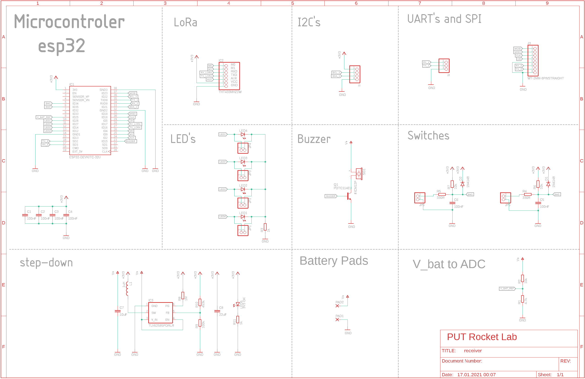
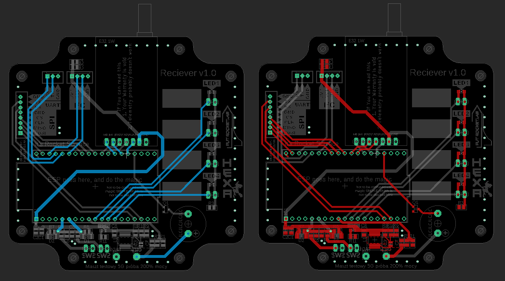
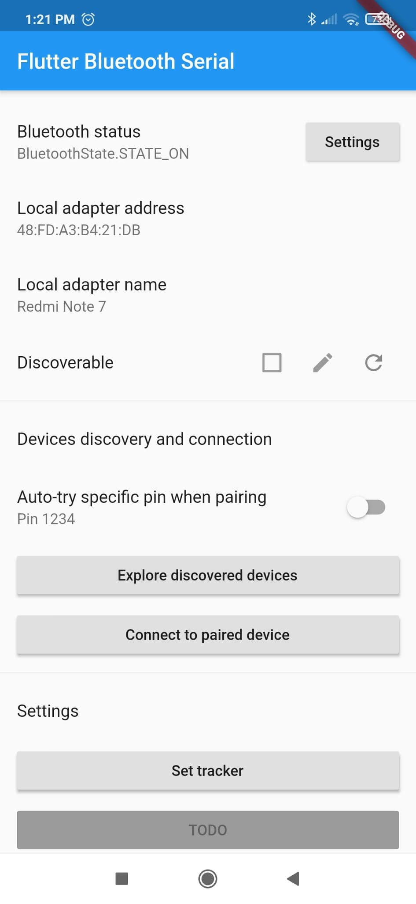
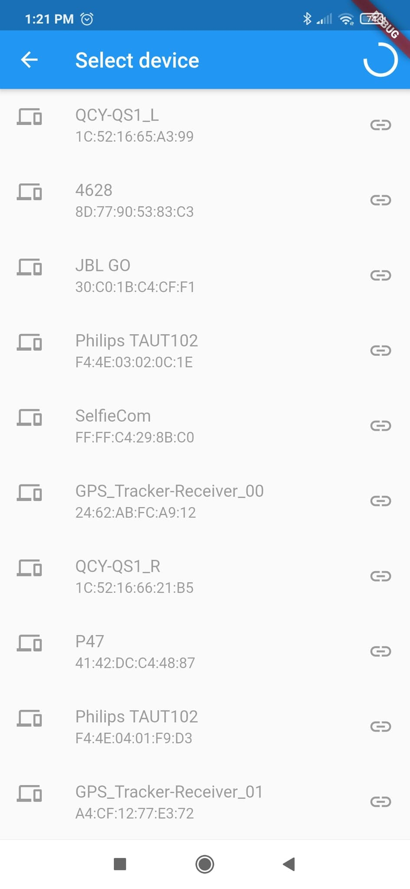

# Rocket Localization System

## About

[PUT Rocket Lab](https://tyraka.pl/) jest Kołem Naukowym z Politechniki Poznańskiej zajmującym się projektowaniem, budowaniem oraz testowaniem technologii
rakietowych. Flagowym projektem zespołu jest budowa rakiety sondażowej
Hexa 2 napędzanej hybrydowym silnikiem rakietowym. Jednym z większych problemów, z jakimi przychodzi zmagać się inżynierom budującym
rakiety, jest ich odzysk. Podczas testów rakieta zostaje wystrzelona w
przestrzeń. Wysokość oraz uzyskiwana prędkość obiektu jest oszacowana z
dużą dokładnością. Komplikacje pojawiają się przy estymowaniu miejsca
spadku rakiety, gdyż jest ono zależne w głównej mierze od powodzenia się
wszystkich procedur lądowania oraz w dużym stopniu od czynników meteorologicznych. Istotą odzysku jest zlokalizowanie rakiety w celu znalezienia
części, które są zdatne do ponownego użycia oraz tych, które już nie zadziałają, ale by zanieczyszczały środowisko. Większość zespołów decyduje
się na bardzo drogie komercyjne rozwiązania, które mimo wszystko nie są
wolne od ograniczeń. W tym repozytorium przedstawiony jest autorski projekt systemu lokalizacji rakiet stratosferycznych.

- [Rocket Localization System](#rocket-localization-system)
  - [About](#about)
  - [GPS Tracker](#gps-tracker)
    - [Hardware](#hardware)
      - [Sensors and Components](#sensors-and-components)
      - [Schema](#schema)
      - [Board](#board)
    - [Software](#software)
      - [Block Diagram](#block-diagram)
  - [Receiver](#receiver)
    - [Hardware](#hardware-1)
      - [Sensors and Components](#sensors-and-components-1)
      - [Schema](#schema-1)
      - [Board](#board-1)
    - [Software](#software-2)
  - [LoRa Library - RadioTyraka](#lora-library---radiotyraka)
  - [Mobile App](#mobile-app)
    - [Software](#software-3)
  - [App's](#web-app)

## GPS Tracker

Pierwszą częścia systemu lokalizacji jest GPS Tracker. Urządzenie to umieszczone wewnątrz rakiety, przy pomocy fal radiowych rozsyła informację na temat swojego aktualnego połorzenia w przestrzeni.

### Hardware

Do komunikacji radiowej ziemia-powietrze posłużyła warstwa fizyczna systemu dalekiego zasięgu - LoRa, protokuł łączności został zaimplementowany według potrzeb naszego zespołu. LoRa używa techniki modulacji z widmem rozproszonym CSS (ang. chirp spread spectrum), która jest uznawana za pierwszą niskokosztową implementację tego rodzaju modulacji do zastosowań komercyjnych. Długość i szerokość geograficzna pozyskiwane są za pomooca systemu nawigacji satelitarnej. Wysokość obliczana jest na podstawie odczytu ciśnienia atmosferycznego mierzonego przez barometr. Z uwagi na stosunkowo niską przepustowość łącza radiowego wszystkie nadmiarowe dane zapisywane sa w trwałej pamięci flash.

Urządzenie jest także wyposażone w akumulator litowo-polimerowy i moduł umożliwiający jego ładowanie przez złącze mini-USB. Cztery diody led pełnią rolę prostego interfejsu, który informuje użytkownika o bierzących ustawieniach. Ustawienia te mogą być konfigurowane poprzez deydkowaną aplikację, która pozwala na ustawienie takich parametrów jak kanał radiowy, moc transmitowanego sygnału oraz data rate. Komunikacja z aplikacją odbywa się poprzez uniwersalny port asynchroniczny - UART. Urządzenie posiada 4 pinowe złącze któe przy pomocy konwertera UART-USB umożliwia podłączenie do komputera. Ostatnim ważnym elementem urządzenia jest włącznik zasilania o logice bistabilnej. Urządzenie zostaje uruchomione poprzez wyciągnięcie specjalnej zworki, tzw "Remove before fly".

<em>Figure 1. Render of GPS Tracker Board</em>

#### Sensors and components

Poniższa tabela przedstawia wszytkie moduły cyforwe wykorzystane w projekcie GPS tracker'a wraz z odnośnikiem do poszczególnych dokumentacji.

| Sensor          |          Device |                                                    Datasheet |
| --------------- | --------------: | -----------------------------------------------------------: |
| uC              |      STM32 F411 |              [datasheet](Hardware/datasheet/stm32f411ce.pdf) |
| GPS             |     Quectel L80 | [datasheet](Hardware/datasheet/L80_Hardware_Design_V1.1.pdf) |
| Radio           | LoRa E32-ttl-1W |   [datasheet](Hardware/datasheet/E32-433T30D_Usermanual.pdf) |
| Barometer       |          BMP280 |               [Hardware/datasheet](datasheet/BST-BMP280.pdf) |
| Flash memory    |         W25Q128 |                [Hardware/datasheet](datasheet/w25q128fv.pdf) |
| Battery charger | MCP73833-AMI/UN |             [Hardware/datasheet](datasheet/22005a-76648.pdf) |

#### Schema

Poniżej przedstawiony został dokładny schemat GPS tracker'a.

- [link do pliku z schematem](Hardware/gps_tracker2.0/gps_tracker2.0.sch)

<em>Figure 2. Schema of GPS Tracker</em>

#### Board

Na poniższym obrazku przedstawione zostały obie strony dwustronnej płytki PCB, która łączy wszytskie elementy. Lewa strona (niebieskie ścieżki) przedstawia dolną warstwę natomiast prawa (czerwone ścieżki) górną warstwę.

- [link do piku z płytką PCB](Hardware/gps_tracker2.0/gps_tracker2.0.sch)

<em>Figure 3. GPS Tracker board</em>

### Software

Napisanie oprogramowania obsługującego moduły urządzenia oraz utworzenie protokołu komunikacyjnego jest niezbędne, by obsłużyć hardware i spełnić wymagania,
które stawiane są przed GPS Tracker'em. W tym celu wykorzystany został popularny framework STM32duino wraz, który jest wygodną i przyjemną platformą do tworzenia aplikacji dla
systemów wbudowanych.
GPS Tracker działa w oparciu o system czasu rzeczywistego FreeRTOS, aby dawać gwarancję wykonania zadań w określonym czasie. Symulacja wielowątkowego działania procesora pozwala
na odczytywanie danych z wszytskich sensorów z maksymalną częstotliwością czujników. Wszystkie dane zapisywane są w trwałej pamięci flash, dzięki czemu po znaleieniu rakiety mogą zostać one odczytane, a na ich podstawie możliwe jest wykreślenie na mapie dokładnego toru lotu rakiety.

Na potrzeby obsługi nowoczesnego modułu komunikacji dalekiego zasięgu -
LoRa - została napisana dedykowana biblioteka. Więcej informacji na jej temat można znaleźć [tutaj](#lora-library---radiotyraka)

#### Block Diagram

Na pozniższym obrazku przedstawiony został schemat blokowy procesów wykonywanych w ramach działania systemu czasu rzeczywistego zaimplementowanego na potrzeby obługi GPS Tracker'a.

- [link do pliku z kodem źródłowym GPS Tracker'a](Software/gps_tracker/transmiterRTOS_ConfigRadioTyraka.ino)

 <em>Figure 4. GPS Tracker code diagram</em>

## Receiver

Drugą częścią systemu jest Receiver, który wraz z smartfonem tworzy stację odbiorczą dla sygnału emitowanego z rakiety. Urządzenie wyposażone w antenę kierunkową pozwala na łączność z rakietami odbywającymi loty stratosferyczne. Odebrane dane wizualizowane są w czasie rzeczywistym na mapie satelitarnej na ekranie połączonego smartfona.

### Hardware

Receiver jest stosunkowo prostym urządzeniem, wyposażoy jest oczywiście w odbiornik radiowy umożliwiający nawiązenie komunikaji radiowej z rakietą oraz jego działanie oparte jest o mikrokontroler ESP32, który posiada zintegrowany moduł Bluetooth i Wi-Fi. Urządzenie wyposażone jest także w 4 złącza umożliwiające komunikację przewodową poprzez różne protokoły, takie jak 2x UART, SPI, I2C. Zastosowanie tak mnogiej liczby interfejsów sprawia, że receiver jest bardzo uniwersalnym urządzeniem, które może zostać w łatwy i przyjemny sposób wykorzystane w wielu projektach jako gateway dla sygnału radiowego LoRa.

Na potrzeby naszego systemu wykorzystywane są trzy interfejsy. Przy pomocy standardu bezprzewodowego Bluetooth Receiver łączy się z smartfonem który przy pomocy dedykowanej aplikacji staje wyświetlaczem dla danych telemetrycznych odbieranych z rakiety.
standard komunikacji Wi-Fi, wykorzystywany jest do postowania odebranych danych na server za pomocą rest api.
Użytkownik ma dostęp do nich poprzez naszą aplikację, która archiwizuje i umożliwia przeglądanie wszystkich danych z różnych lotów i testów.
Ostatnim wykorzystanym interfejsem jest UART, podpobnie jak w przypadku GPS Tracker'a służy on do konfigurowania parametrówtransmisji takich jak kanał radiowy, moc transmitowanego sygnału oraz data rate.

#### Sensors and components

Poniższa tabela przedstawia wszytkie moduły cyforwe wykorzystane w projekcie GPS tracker'a wraz z odnośnikiem do poszczególnych dokumentacji.

| Sensor |          Device |                                                  Datasheet |
| ------ | --------------: | ---------------------------------------------------------: |
| uC     |           ESP32 |        [datasheet](Hardware/datasheet/esp32_datasheet.pdf) |
| Radio  | LoRa E32-ttl-1W | [datasheet](Hardware/datasheet/E32-433T30D_Usermanual.pdf) |

#### Schema

Poniżej przedstawiony został dokładny schemat Receivera.

- [link do pliku z schematem](Hardware/receiver/receiver.sch)

<em>Figure 5. Schema of Receiver</em>

#### Board

Na poniższym obrazku przedstawione zostały obie strony dwustronnej płytki PCB, która łączy wszytskie elementy. Lewa strona (niebieskie ścieżki) przedstawia dolną warstwę natomiast prawa (czerwone ścieżki) górną warstwę.

- [link do piku z płytką PCB](Hardware/receiver/receiver.brd)

<em>Figure 6. Receiver board</em>

### Software

Podobnie jak w przypadku GPS Tracker'a kod został napisany z wykorzystaniem freamworku Arduino. Jednak w tym przypadku system czasu rzeczywistego nie został wykorzystany, kod działa w sposób proceduralny.
Do obsługi modułu komunikacji radiowej, również została wykorzystana autorska biblioteka.

`NOTE : marge kodów do receivera w progresie`

`NOTE 2: prace nad implementacją RTOS wersji dla receivera trwają`

#### Block Diagram

Na pozniższym obrazku przedstawiony został schemat blokowy proceduralnego kodu Receiver'a

- [link do pliku z kodem źródłowym Receiver'a](Software/receiver/eciverRadioTyrakaV2.ino)

 <em>Figure 7. Receiver code diagram</em>

## LoRa Library - RadioTyraka

Na potrzeby obsługi nowoczesnego modułu komunikacji dalekiego zasięgu -
LoRa - została napisana dedykowana biblioteka. Biblioteka implementuje protokuł komunkacyjny, który znacząco ułatwia komunikację radiową natomiast obsługa modułu jest przyjamna dla użytkownika. Wydajność łącza radiowego uzyskana dzięki oprogramowaniu naszego zespołu jest większa niż w przypadku użytkowania biblioteki afirmowanej przez producenta modułu.

RadioTyraka powstało jako nakładka na popularną bibliotekę [RadioHead](https://www.airspayce.com/mikem/arduino/RadioHead/). Znacząco usprawnia ona niektóre z funkcji oferowanych przez bibliotekę, a także wprowadza nowe użyteczne rozwiązania. Biblioteka RadioTyraka znajduje się na osobnym repozytorium, które zawiera jej szczegółową dokumentację.

- [link do repozytorium z biblioteką](https://github.com/WiciuTyraka/RadioTyraka)

## Mobile App

W celu wizualizacji lokalizacji szukanego obiektu stworzona została aplikacja mobilna. Aplikacja łączy się za pomocą technologii Bluetooth ze
stacją odbiorczą i pobiera dane dotyczące aktualnej lokalizacji rakiety w czasie rzeczywistym. Dane wizualizowane są na mapie satelitarnej, co
znacznie przyspiesza i ułatwia proces odzyskiwania rakiety.

Na poniższych obrazkach (rys. 8 i 9) widać menu ustawień...

|                                                                                        |                                                                                          |
| :------------------------------------------------------------------------------------: | :--------------------------------------------------------------------------------------: |
|                                            |                                            |
| 
<em>Figure 8. Mobile app setting </em>
 | 
<em>Figure 9. Mobile app setting 2 </em>
 |

Rysunek 10 przedstawia mapę satelitarną...

<em>Figure 10.  Mobile app satelite map display </em>

## APP's

Niniejsza praca dyplomowa została zrealizowana wraz z awioniką Tyraka w ramach przedmiotu "Zespołowy projekt inżynierski" na Wydziale Informatyki i Matematyki Uniwersytetu im. Adama Mickiewicza w Poznaniu. Produkty projektu przeznaczone są dla koła rakietowego Politechniki Poznańskiej. Jest to aplikacja, która pozwala na uporządkowanie, analizę, przechowywanie i wyświetlanie danych z testów rakiet oraz silników. Dzięki temu mamy podgląd do danych z czujników na żywo podczas testów, dane są przedstawiane w postaci wykresów oraz mapy z lokalizacją rakiety co ułatwia odczyt danych. Trzeba zadbać o to, by dane były poprawnie zapisane, aby po teście móc wykonać analizę — w tym celu dane będą eksportowe do Excela. W przypadku testu silnika aplikacja oblicza średni ciąg, czas spalania, impuls całkowity oraz właściwy. Testy będą sortowane oraz filtrowane, aby ułatwić do nich dostęp. Aplikacja umożliwia konfigurowanie oraz kontrolowanie modułów elektronicznych, zmianę parametrów uruchomieniowych modułu, odczyt danych i czyszczenie pamięci flash.

Desktopowa aplikacja serwerowa odpowiada za odczytywanie danych wysyłanych przez elektronikę naziemną oraz przekazywanie ich w czasie rzeczywistym do aplikacji desktopowej. Zapisuje też ona otrzymane pomiary do odpowiednich plików JSON, w celu późniejszego wysłania ich do aplikacji webowej.

Serwer lokalny umożliwia również komunikację poprzez interfejs USB z komaptybilnym urządzeniem takim jak GPS tracker lub Receiver. Dzięki temu użytkownik jest w stanie wysyłać do niej polecenia i ma możliwość jej prostej konfiguracji, bez znajomości języka C++. Użytkownik ma też możliwość pobierania i czytania plików bezpośrednio z płytki urządzenia.

Głównym zadaniem webowej aplikacji serwerowej jest gromadzenie i możliwość eksportu danych historycznych do formatu JSON oraz CSV. Każdy użytkownik ma możliwość zalogowania się i dostęp do ograniczonych funkcjonalności aplikacji. Pełen dostęp posiada administrator, który zakłada konta użytkowników i zarządza aplikacją. Serwer webowy korzysta z nierelacyjnej bazy danych. Użytkownicy mają możliwość wyszukiwania konkretnych testów, jak i listowania większej ich ilości za pomocą dostępnych filtrów i funkcji sortujących.

Częścią projektu jest też strona internetowa, która ma pełnić funkcję wizytówki koła w Internecie. Na tej samej domenie co wizytówka będzie można zalogować się jako członek koła i uzyskać dostęp do panelu historii testów. Możliwa będzie analiza i odtworzenie zapisu live z przeprowadzonych testów. Oprócz ich wyświetlania będzie można wgrywać nowe testy z plików oraz eksportować je w formacie JSON i CSV. Kolejną częścią systemu Tyraka jest aplikacja desktopowa stworzona za pomocą frameworka Electron, na której zobaczyć będzie można testy w czasie rzeczywistym, wgrywać testy z plików oraz konfigurować elektronikę. Aplikacja webowa oraz desktopowa napisana jest za pomocą frameworka Vue.js.

&nbsp;

---

&nbsp;

_by Wiktor Tasarek_
