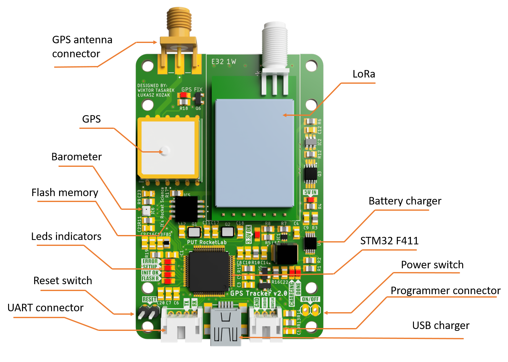

# Rocket Localization System

## About

[PUT Rocket Lab](https://www.facebook.com/putrocketlab) jest Kołem Naukowym z Politechniki Poznańskiej zajmującym się projektowaniem, budowaniem oraz testowaniem technologii
rakietowych. Flagowym projektem zespołu jest budowa rakiety sondażowej
Hexa 2 napędzanej hybrydowym silnikiem rakietowym. Jednym z większych problemów, z jakimi przychodzi zmagać się inżynierom budującym
rakiety, jest ich odzysk. Podczas testów rakieta zostaje wystrzelona w
przestrzeń. Wysokość oraz uzyskiwana prędkość obiektu jest oszacowana z
dużą dokładnością. Komplikacje pojawiają się przy estymowaniu miejsca
spadku rakiety, gdyż jest ono zależne w głównej mierze od powodzenia się
wszystkich procedur lądowania oraz w dużym stopniu od czynników meteorologicznych. Istotą odzysku jest zlokalizowanie rakiety w celu znalezienia
części, które są zdatne do ponownego użycia oraz tych, które już nie zadziałają, ale by zanieczyszczały środowisko. Większość zespołów decyduje
się na bardzo drogie komercyjne rozwiązania, które mimo wszystko nie są
wolne od ograniczeń. W tym repozytorium przedstawiony jest autorski projekt systemu lokalizacji rakiet stratosferycznych.

- [Rocket Localization System](#rocket-localization-system)
  - [About](#about)
  - [GPS Tracker](#gps-tracker)
    - [Hardware](#hardware)
      - [Sensors and Components](#sensors-and-components)
      - [Schema](#schema)
      - [Board](#board)
    - [Software](#software)
      - [Block Diagram](#block-diagram)
  - [Receiver](#receiver)
    - [Hardware](#hardware-1)
      - [Sensors and Components](#sensors-and-components-1)
      - [Schema](#schema-1)
      - [Board](#board-1)
    - [Software](#software)
  - [LoRa Library](#lora-library)
    - [Setting and Basic Usage](#setting-and-basic-usage)
      - [Pinout](#pinout)
      - [Constructor](#constructor)
  - [Mobile App](#mobile-app)
    - [Software](#software)
  - [Web App](#web-app)
    - [Software](#software)

## GPS Tracker

Pierwszą częścia systemu lokalizacji jest GPS Tracker. Urządzenie to umieszczone wewnątrz rakiety, przy pomocy fal radiowych rozsyła informację na temat swojego aktualnego połorzenia w przestrzeni.

### Hardware

Do komunikacji radiowej ziemia-powietrze posłużyła warstwa fizyczna systemu dalekiego zasięgu - LoRa, protokuł łączności został zaimplementowany według potrzeb naszego zespołu. LoRa używa techniki modulacji z widmem rozproszonym CSS (ang. chirp spread spectrum), która jest uznawana za pierwszą niskokosztową implementację tego rodzaju modulacji do zastosowań komercyjnych. Długość i szerokość geograficzna pozyskiwane są za pomooca systemu nawigacji satelitarnej. Wysokość obliczana jest na podstawie odczytu ciśnienia atmosferycznego mierzonego przez barometr. Z uwagi na stosunkowo niską przepustowość łącza radiowego wszystkie nadmiarowe dane zapisywane sa w trwałej pamięci flash.

Urządzenie jest także wyposażone w akumulator litowo-polimerowy i moduł umożliwiający jego ładowanie przez złącze mini-USB. Cztery diody led pełnią rolę prostego interfejsu, który informuje użytkownika o bierzących ustawieniach. Ustawienia te mogą być konfigurowane poprzez deydkowaną aplikację, która pozwala na ustawienie takich parametrów jak kanał radiowy, moc transmitowanego sygnału oraz data rate. Komunikacja z aplikacją odbywa się poprzez uniwersalny port asynchroniczny - UART. Urządzenie posiada 4 pinowe złącze któe przy pomocy konwertera UART-USB umożliwia podłączenie do komputera. Ostatnim ważnym elementem urządzenia jest włącznik zasilania o logice bistabilnej. Urządzenie zostaje uruchomione poprzez wyciągnięcie specjalnej zworki, tzw "Remove before fly".

<em>Figure 1. Render of GPS Tracker Board</em>

#### Sensors and components

Poniższa tabela przedstawia wszytkie moduły cyforwe wykorzystane w projekcie GPS tracker'a wraz z odnośnikiem do poszczególnych dokumentacji.

| Sensor          |          Device |                                                    Datasheet |
| --------------- | --------------: | -----------------------------------------------------------: |
| uC              |      STM32 F411 |              [datasheet](Hardware/datasheet/stm32f411ce.pdf) |
| GPS             |     Quectel L80 | [datasheet](Hardware/datasheet/L80_Hardware_Design_V1.1.pdf) |
| Radio           | LoRa E32-ttl-1W |   [datasheet](Hardware/datasheet/E32-433T30D_Usermanual.pdf) |
| Barometer       |          BMP280 |               [Hardware/datasheet](datasheet/BST-BMP280.pdf) |
| Flash memory    |         W25Q128 |                [Hardware/datasheet](datasheet/w25q128fv.pdf) |
| Battery charger | MCP73833-AMI/UN |             [Hardware/datasheet](datasheet/22005a-76648.pdf) |

#### Schema

Poniżej przedstawiony został dokładny schemat GPS tracker'a.

- [link do pliku z schematem](Hardware/gps_tracker2.0/gps_tracker2.0.sch)

<em>Figure 2. Schema of GPS Tracker</em>

#### Board

Na poniższym obrazku przedstawione zostały obie strony dwustronnej płytki PCB, która łączy wszytskie elementy. Lewa strona (niebieskie ścieżki) przedstawia dolną warstwę natomiast prawa (czerwone ścieżki) górną warstwę.

- [link do piku z płytką PCB](Hardware/gps_tracker2.0/gps_tracker2.0.sch)

<em>Figure 3. GPS Tracker board</em>

### Software

Napisanie oprogramowania obsługującego moduły urządzenia oraz utworzenie protokołu komunikacyjnego jest niezbędne, by obsłużyć hardware i spełnić wymagania,
które stawiane są przed GPS Tracker'em. W tym celu wykorzystany został popularny framework STM32duino wraz, który jest wygodną i przyjemną platformą do tworzenia aplikacji dla
systemów wbudowanych.
GPS Tracker działa w oparciu o system czasu rzeczywistego FreeRTOS, aby dawać gwarancję wykonania zadań w określonym czasie. Symulacja wielowątkowego działania procesora pozwala
na odczytywanie danych z wszytskich sensorów z maksymalną częstotliwością czujników. Wszystkie dane zapisywane są w trwałej pamięci flash, dzięki czemu po znaleieniu rakiety mogą zostać one odczytane, a na ich podstawie możliwe jest wykreślenie na mapie dokładnego toru lotu rakiety.

Na potrzeby obsługi nowoczesnego modułu komunikacji dalekiego zasięgu -
LoRa - została napisana dedykowana biblioteka. Więcej informacji na jej temat można znaleźć [tutaj](#LoRa-Library)

#### Block Diagram

Na pozniższym obrazku przedstawiony został schemat blokowy procesów wykonywanych w ramach działania systemu czasu rzeczywistego zaimplementowanego na potrzeby obługi GPS Tracker'a.

- [link do pliku z kodem źródłowym GPS Tracker'a](Software/gps_tracker/transmiterRTOS_ConfigRadioTyraka.ino)

 <em>Figure 4. GPS Tracker code diagram</em>

## Receiver

Drugą częścią systemu jest Receiver, który wraz z smartfonem tworzy stację odbiorczą dla sygnału emitowanego z rakiety. Urządzenie wyposażone w antenę kierunkową pozwala na łączność z rakietami odbywającymi loty stratosferyczne. Odebrane dane wizualizowane są w czasie rzeczywistym na mapie satelitarnej na ekranie połączonego smartfona.

### Hardware

Receiver jest stosunkowo prostym urządzeniem, wyposażoy jest oczywiście w odbiornik radiowy umożliwiający nawiązenie komunikaji radiowej z rakietą oraz jego działanie oparte jest o mikrokontroler ESP32, który posiada zintegrowany moduł Bluetooth i Wi-Fi. Urządzenie wyposażone jest także w 4 złącza umożliwiające komunikację przewodową poprzez różne protokoły, takie jak 2x UART, SPI, I2C. Zastosowanie tak mnogiej liczby interfejsów sprawia, że receiver jest bardzo uniwersalnym urządzeniem, które może zostać w łatwy i przyjemny sposób wykorzystane w wielu projektach jako gateway dla sygnału radiowego LoRa.

Na potrzeby naszego systemu wykorzystywane są trzy interfejsy. Przy pomocy standardu bezprzewodowego Bluetooth Receiver łączy się z smartfonem który przy pomocy dedykowanej aplikacji staje wyświetlaczem dla danych telemetrycznych odbieranych z rakiety.
standard komunikacji Wi-Fi, wykorzystywany jest do postowania odebranych danych na server za pomocą rest api.
Użytkownik ma dostęp do nich poprzez naszą aplikację, która archiwizuje i umożliwia przeglądanie wszystkich danych z różnych lotów i testów.
Ostatnim wykorzystanym interfejsem jest UART, podpobnie jak w przypadku GPS Tracker'a służy on do konfigurowania parametrówtransmisji takich jak kanał radiowy, moc transmitowanego sygnału oraz data rate.

#### Sensors and components

Poniższa tabela przedstawia wszytkie moduły cyforwe wykorzystane w projekcie GPS tracker'a wraz z odnośnikiem do poszczególnych dokumentacji.

| Sensor |          Device |                                                  Datasheet |
| ------ | --------------: | ---------------------------------------------------------: |
| uC     |           ESP32 |        [datasheet](Hardware/datasheet/esp32_datasheet.pdf) |
| Radio  | LoRa E32-ttl-1W | [datasheet](Hardware/datasheet/E32-433T30D_Usermanual.pdf) |

#### Schema

Poniżej przedstawiony został dokładny schemat Receivera.

- [link do pliku z schematem](Hardware/receiver/receiver.sch)

<em>Figure 5. Schema of Receiver</em>

#### Board

Na poniższym obrazku przedstawione zostały obie strony dwustronnej płytki PCB, która łączy wszytskie elementy. Lewa strona (niebieskie ścieżki) przedstawia dolną warstwę natomiast prawa (czerwone ścieżki) górną warstwę.

- [link do piku z płytką PCB](Hardware/receiver/receiver.brd)

<em>Figure 6. Receiver board</em>

### Software

Podobnie jak w przypadku GPS Tracker'a kod został napisany z wykorzystaniem freamworku Arduino. Jednak w tym przypadku system czasu rzeczywistego nie został wykorzystany, kod działa w sposób proceduralny.
Do obsługi modułu komunikacji radiowej, również została wykorzystana autorska biblioteka.

`NOTE : marge kodów do receivera w progresie`

`NOTE 2: prace nad implementacją RTOS wersji dla receivera trwają`

#### Block Diagram

Na pozniższym obrazku przedstawiony został schemat blokowy proceduralnego kodu Receiver'a

- [link do pliku z kodem źródłowym Receiver'a](Software/receiver/eciverRadioTyrakaV2.ino)

 <em>Figure 7. Receiver code diagram</em>

## LoRa Library - RadioTyraka

Na potrzeby obsługi nowoczesnego modułu komunikacji dalekiego zasięgu -
LoRa - została napisana dedykowana biblioteka. Biblioteka implementuje protokuł komunkacyjny, który znacząco ułatwia komunikację radiową natomiast obsługa modułu jest przyjamna dla użytkownika. Wydajność łącza radiowego uzyskana dzięki oprogramowaniu naszego zespołu jest większa niż w przypadku użytkowania biblioteki afirmowanej przez producenta modułu.

RadioTyraka powstało jako nakładka na popularną bibliotekę [RadioHead](https://www.airspayce.com/mikem/arduino/RadioHead/). Znacząco usprawnia ona niektóre z funkcji oferowanych przez bibliotekę, a także wprowadza nowe użyteczne rozwiązania.

- [link do biblioteki](Software/)

### Setting and Basic Usage

## Pinout

| Pin no. | Pin name |         Pin direction | Pin application                                                                                                                                                                                                                                                                                                                               |
| ------- | -------: | --------------------: | --------------------------------------------------------------------------------------------------------------------------------------------------------------------------------------------------------------------------------------------------------------------------------------------------------------------------------------------- |
| 1       |       M0 | Input（weak pull-up） | Work with M1 & decide the four operating modes.Floating is not allowed, can be ground.                                                                                                                                                                                                                                                        |
| 2       |       M1 | Input（weak pull-up） | Work with M0 & decide the four operating modes.Floating is not allowed, can be ground.                                                                                                                                                                                                                                                        |
| 3       |      RXD |                 Input | TTL UART inputs, connects to external (MCU, PC) TXD outputpin. Can be configured as open-drain or pull-up input.                                                                                                                                                                                                                              |
| 4       |      TXD |                Output | TTL UART outputs, connects to external RXD (MCU, PC) inputpin. Can be configured as open-drain or push-pull output                                                                                                                                                                                                                            |
| 5       |      AUX |                Output | To indicate module’s working status & wakes up the external MCU. During the procedure of self-check initialization, the pin outputs low level. Can be configured as open-drain output orpush-pull output (floating is allowed). If you have trouble like freeze device, you must put a pull-up 4.7k resistor or better connect to the device. |
| 6       |      VCC |                       | Power supply 2.3V~5.5V DC                                                                                                                                                                                                                                                                                                                     |
| 7       |      GND |                       | Ground                                                                                                                                                                                                                                                                                                                                        |

&nbsp;

Various modes can be set via M0 and M1 pins.

| Mode         |  M1 |  M0 | Explanation                                                                                                                                                    |
| ------------ | --: | --: | -------------------------------------------------------------------------------------------------------------------------------------------------------------- |
| Normal       |   0 |   0 | UART and wireless channel is good to go                                                                                                                        |
| Wake-up      |   0 |   1 | Same as normal but a preamble code is added to transmitted data for waking-up the receiver.                                                                    |
| Power-Saving |   0 |   0 | UART is disable and wireless is on WOR(wake on radio) mode which means the device will turn on when there is data to be received. Transmission is not allowed. |
| Sleep        |   0 |   1 | Used in setting parameters. Transmitting and receiving disabled.                                                                                               |

## Constructor

 You can have multiple instances of Contructor, but each instance must have its own serial connection, M0 M1 and AUX connections. Initialises the mode of the referenced pins Does NOT set the baud rate of the serial connection to the radio.

    RadioTyraka( Stream *s = &Serial,
                 uint8_t m0_pin = 4,
                 uint8_t m1_pin = 5,
                 uint8_t aux_pin = 8,
                 uint8_t ID = 0
                 );

**Parameters**

- `*s` - pointer to Stream class object. Used for UART communication between the microcontroler and LoRa device. HardwareSerial or SoftwareSerial object shouldbe used in constructor invoke.
- `m0_pin` and `m1_pin` - pins used for changing operation mode.
- `aux_pin` - is a pin that check the operation, transmission and receiving status.
- `ID` - a unique identifier in the range 1-255. enables identification of the transmitting device. It is not needed for correct operation, the default value is 0.

## Init

Itialise the device transport hardware and software. Make sure the RadioTyraka is properly, including setting the serial port baud rate and parity to that configured in the radio (typically 9600 baud, 8N1) before calling init(). Sets the module to default transmition values (these setting can be changed after initialisation with the various set\* functions):

- Transmition frequency - 443MHz,
- Transmision power - 21dBm,
- Data rate - 5kpbs.

This function may not return if the AUX pin is not connected. Initialisation failure can be caused by: Electrical connections to the radio, incorrect or incomplete Radio configured to use a different baud rate to the one configured to the microcontoler serial port, incorrect radio module connected to the serial port. Other serial communicaitons problems between the microcontroler and the radio device.

**Returns**

&nbsp;&nbsp;&nbsp;&nbsp;&nbsp;&nbsp; true if initialisation succeeded.

&nbsp;

inherited from RadioHead.

##
